- DFS ( Depth-First Search)
- DFS는 김피 우선 탐색 이라고도 부르며 그래프에서 깊은 부분을 우선적으로 탐색하는 알고리즘이다.
- DFS는 스택자료구조(혹은 재귀함수)를 이용하며, 구체적인 동작과정은 다음과 같다.
  1. 탐색 시작 노드를 스택에 삽입하고 방문처리를 한다
  2. 스택의 최상단 노드에 방문하지 않은 인접한 노드가 하나라도 있으면 그 노드를 스택에 넣고 처리한다. 방문하지 않은 인접 노드가 없으면 스택에서 최상단 노드를 꺼낸다
  3. 더 이상 2번의 과정을 수행할 수 없을 때까지 반복한다.

- 동작 예시
  - step1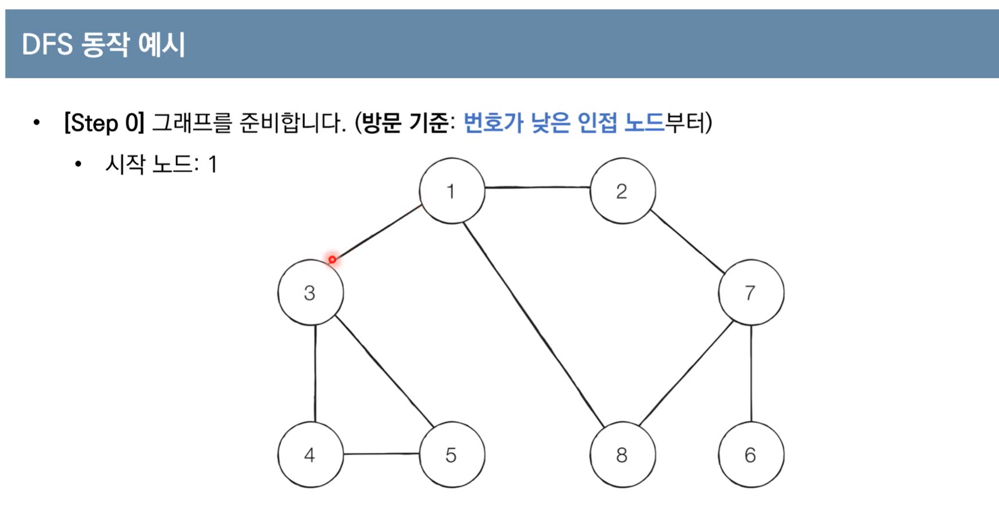 (무방향)
  - step2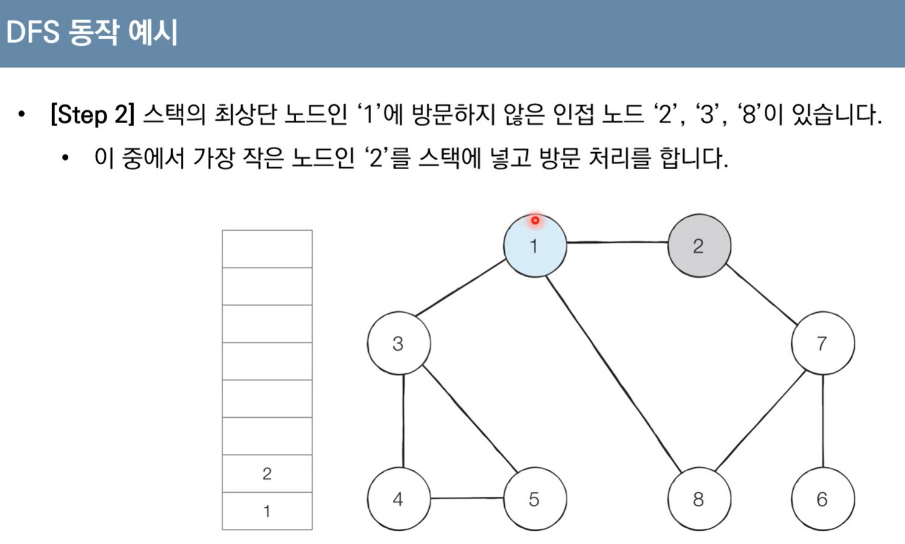 ( 2로 이동하면 이제 스택의 최상단 노드는 2가 된다)
  - step 3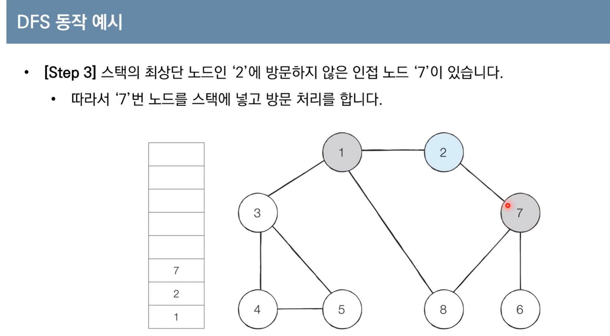
  - step4 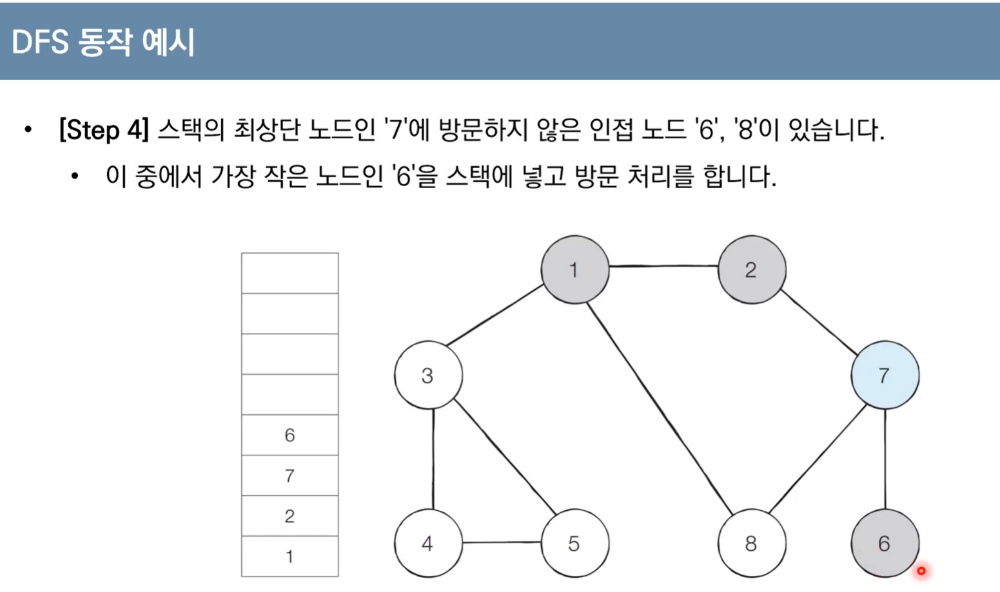 (가장 깊은 노드는 6?)
  - step5 이제 최상단 노드는 6인데 인접한, 이동할 노드가 없음. 이러면 원소 6을 스택에서 꺼내주고 7로 돌아간다)
  - step6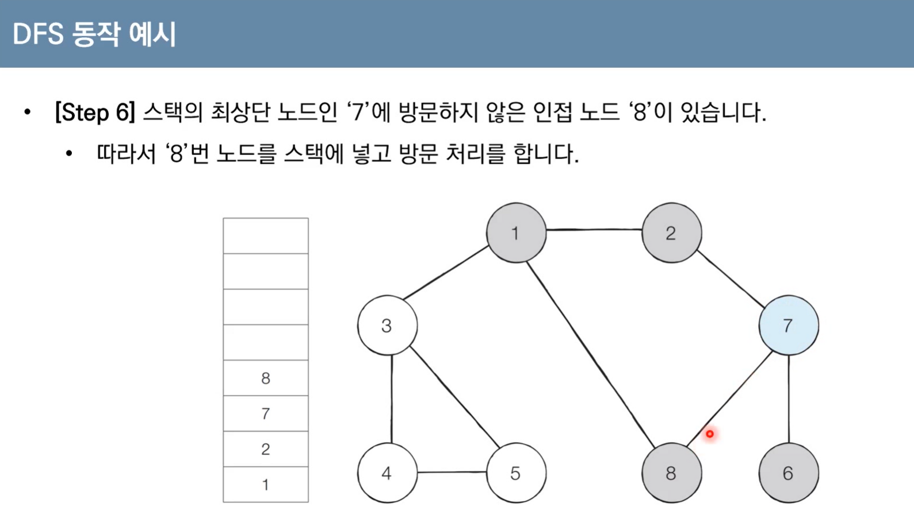
  - 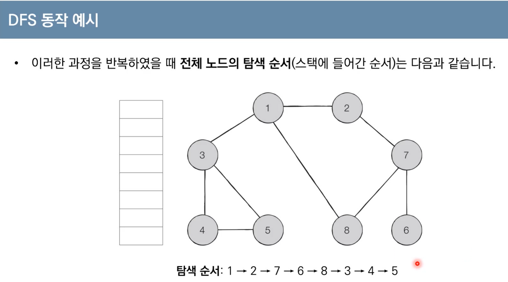 ( 최대한 깊게 들어가는 형태)

- 파이썬
- 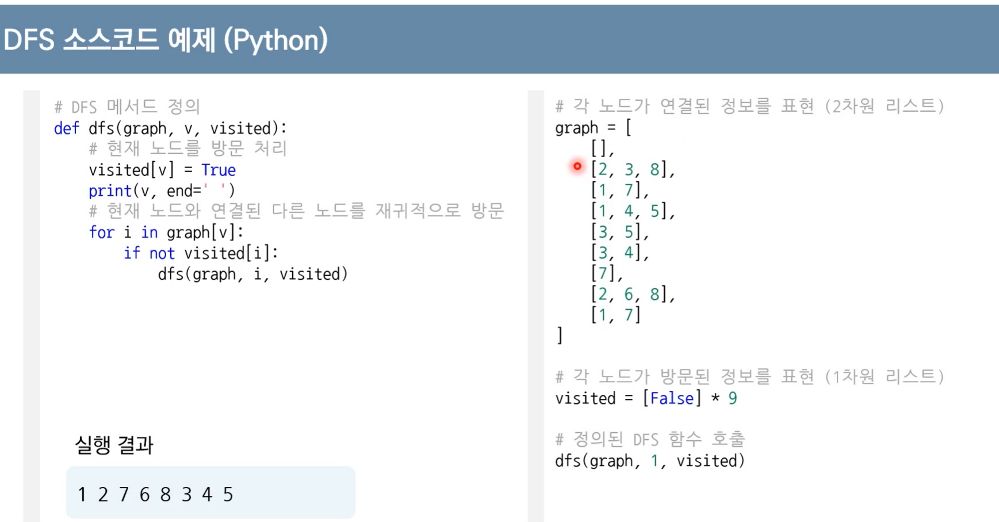

- ```
  최상단 노드외 인접한 형태를 리스트로 표현
  방문한 목록을 리스트로 표현
  인덱스 0을 사용하지 않기위해 리스트를 9까지 만듦
  해당 노드에 방문하게 하고, 방문한 내역을 알 수 있게 print 함
  스택의 최상단 노드와 연결된 다른 노드를 하나씩 확인하면서  인접한 노드가 방문하지 않은 상태라면 그 노드에 대해서도 마찬가지로 재귀함수를 이용해 방문을 수행. 깊게
  
  ```


- BFS ( Bradth-Fisrt Search)
-  BFS는 **너비우선 탐색**이라고도 하며, **그래프에서 가까운 노드부터** 우선적으로 탐색하는 알고리즘
- BFS는 큐 자료구조를 이용하며, 구체적인 동작과정은 다음과 같다
  1. 탐색 시작 노드를 큐에 삽입하고 방문처리를 한다
  2. 큐에서 노드를 꺼낸 뒤에 해당 노드의 인접 노드 중에서 방문하지 않은 노드를  **모두**  큐에 삽입항 처리한다.
  3. 더 이상 2번의 과정을 수행할 수 없을 때까지 반복한다

- step1)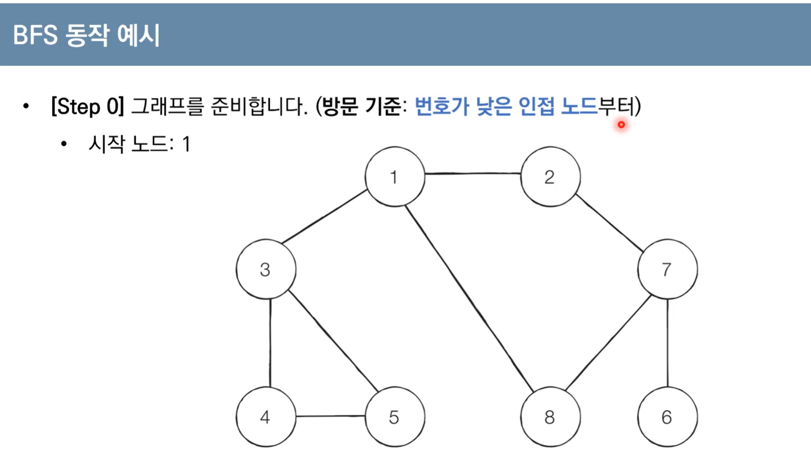
- step2)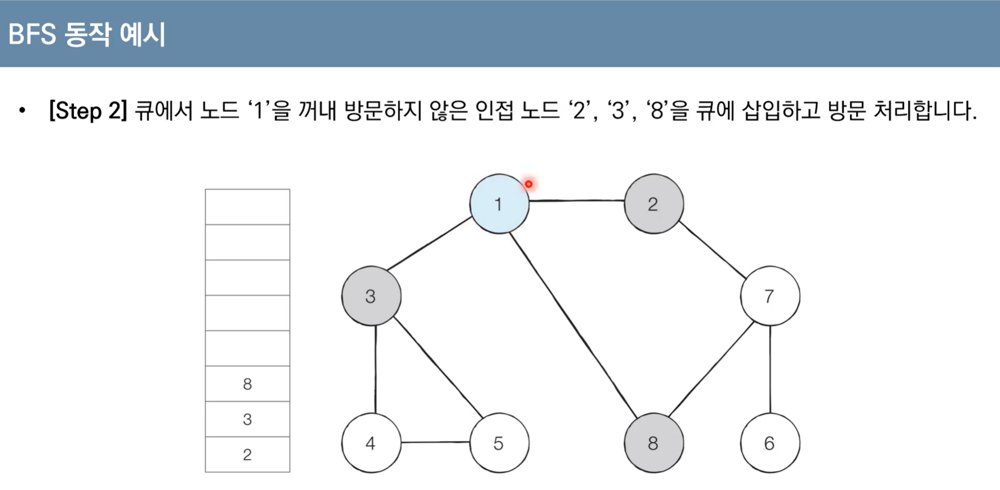 (큐에 넣을 땐 한번에 넣지만, 순서는 작은 수부터)
- step3)
- 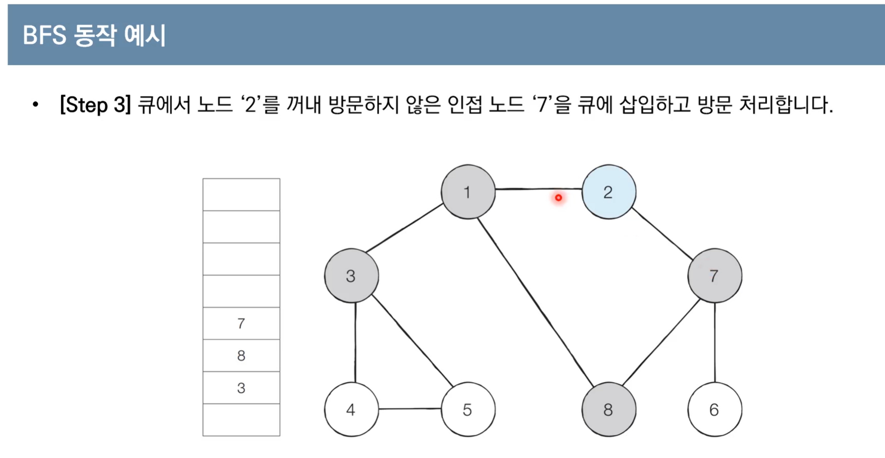
- step4)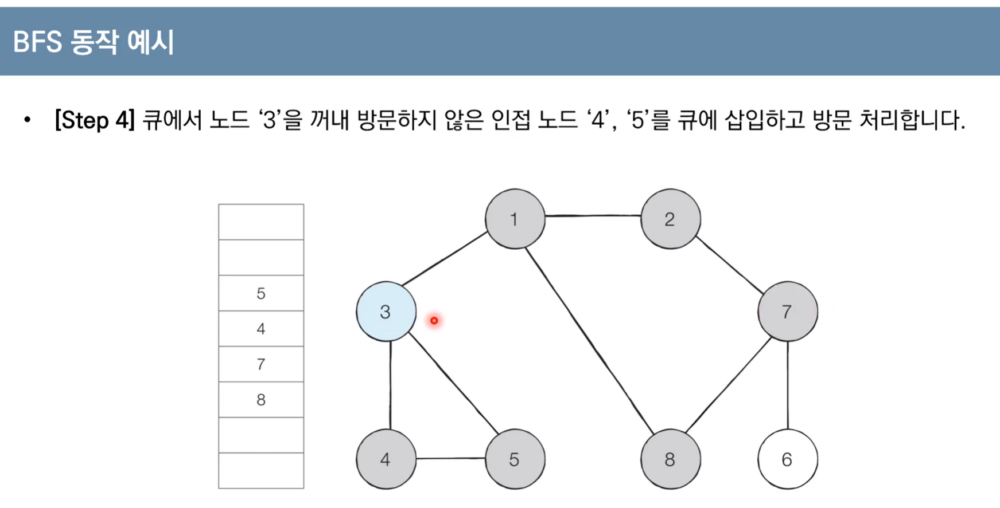
- step5)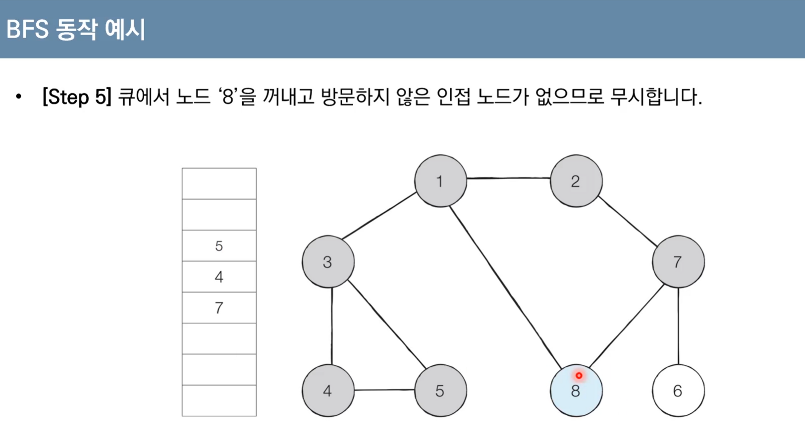 ( 8은 인접한 노드가 없기 때문에 8은 꺼내기만 하고 무시)
- step6)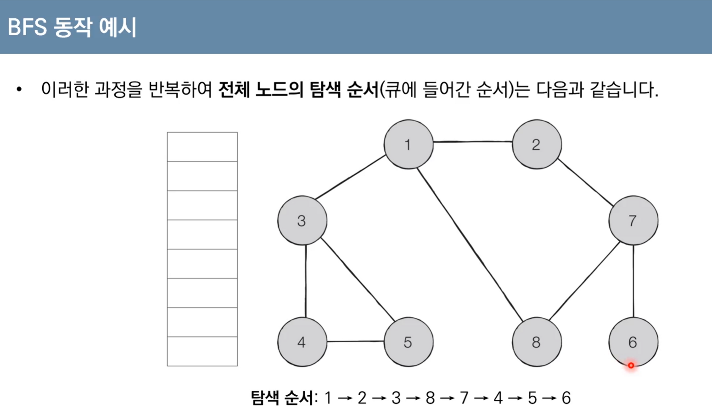


- 파이썬

- 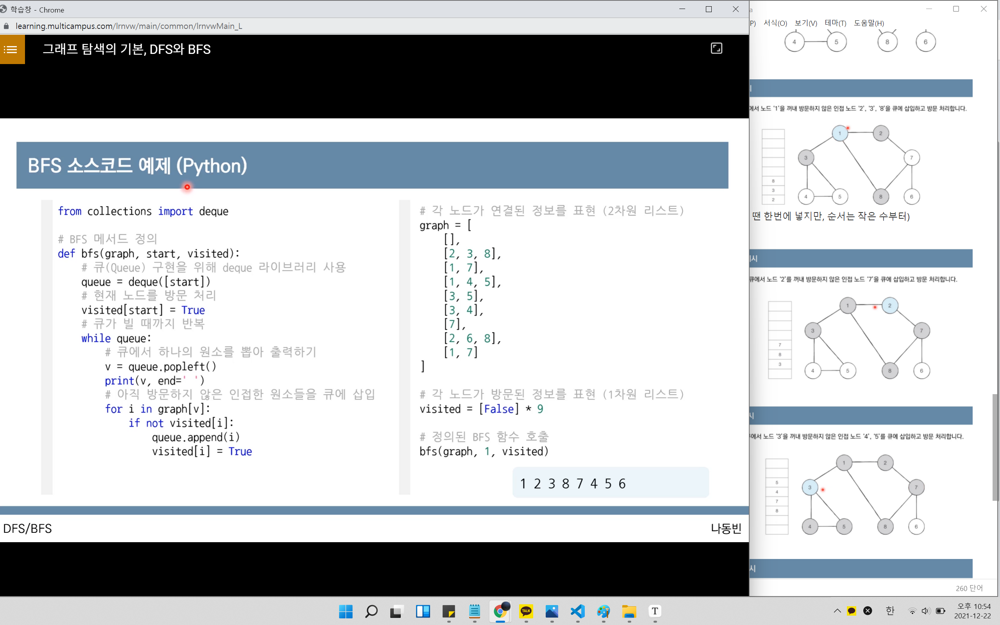

- ```
  큐를 위해서 deque 라이브러리를 불러오고
  0번 노드에 대한 내용은 비워두고, 즉 1번부터 8번까지의 노드 -> 9개인덱스의 리스트를 만들고, 0번은 사용하지 않음
  인접한 노드를 리스트로 표현
  방문정보는 visited라는 리스트로 표현
  bf메소드 시작 노드를 큐에 넣어준다
  시작노드를 방문처리한 뒤 큐가 빌 때까지(수행할 수 없을 때까지) 반복
  큐에서 하나의 원소를 꺼내는데,
  정렬에서 배웠던 가장먼저 들어온 원소를 꺼내는 popleft() 사용
  큐에서 원소를 꺼낸 뒤 해당 노드의 번호를 출력해주고, 해당 노드와 인접한 노드를 확인하며 아직방문하지 않은 노드가 있다면 큐에 넣어준다
  
  
  
  ```

- 