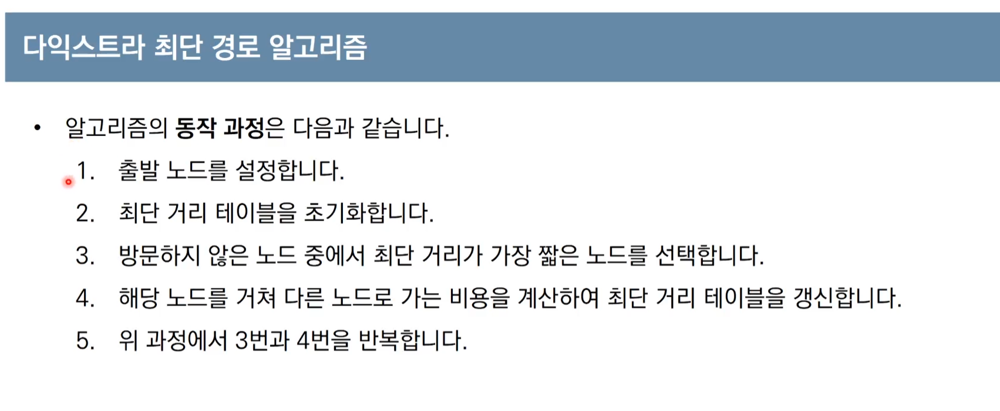
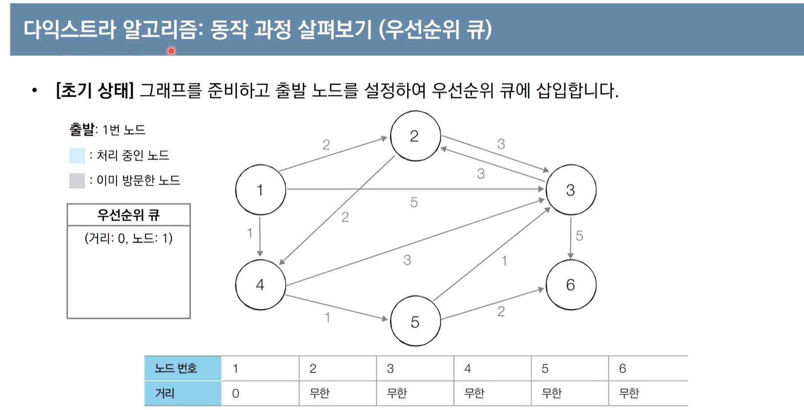

# 10 다익스트라 알고리즘 : 하나의 출발지에서 다른 모든 출발지까지 최단 경로 계산
- 

- 가장 대표적인 최단경로 알고리즘 : 다익스트라

  -  그리디 알고리즘 : 매상황에서 가장 비용이 적은 노드 선택
  -  3번 과정 때문에 그리디 알고리즘 유형으로 봄
  - 
  - 

- 예시

  1.  2번노드로 가는 간선: 무한보다 2가 작기 때문에 값을 2로 바꿈

  2.   4번노드를 거쳐갈 때의 거리값까지 같이 계산.  4번 노드에서 2, 5로의 거리값이 같을 때, 일반적으로는 값이 더 작은 노드부터 방문. -> 2번노드로 이동
  3.   2번 노드를 거쳐갈 때, 3번으로 갈 경우 1에서 2를 거쳐 갈 경우 값은 5. 근데 4를 거쳐서 3으로 갈 경우 4이기 때문에/ 기존의 값인 4보다 5가 크기 때문에 갱신x 
  4.  ㄴㄴ
  5.  
  6.  사실 마지막 노드에 대한 정보는 처리하지 않아도 전체 결과를 얻을 수 있긴 함

- 다익스트라 알고리즘이 특징

  - 

- 다익스트라 알고리즘 : 간단한 구현방법

  - 

  - 파이썬

    - 

    - ```
      기본적으로 테이블을 초기화할 때 무한의 값을 넣기 때문에 무한의 의미로 10억 설정
      
      노드,간선 개수 입력받
      시작노드 번호 입력받
      각 노드마다 연결된 돈듸의 정보를 담기위해 연결리스트 형태로 하나의 그래프 초기화
      또한 방문노드를 처리하기 위해 별도로 visited테이블 생성
      처음엔 모든 노드에 대해 방문처리 안 된 의미로 false 값
      최단 거리 테이블을 모두 무한으로 초기화
      
      for 입력을 받아
      기본적으로 그래프는 방향그래프
      a번째 리스트에 b와 c를 하나의 튜플로 묶어 넣어줌
      
      1번부터 m번까지의 모든 노드를 확인하면서 임의로 처음에 무한의 값을 할당해 놓은 민밸류 변수를 이요해서 방무낳지 않은 변수에 대해 가장 최단거리가 짧은 노드를 반환
      이 함수는 매번 관계를 반복함ㄴ 과정 실행
      
      가장먼저 출발노드에 대해서 초기화
      출발노드는 방문처리
      출발노드까지의 거리는 0으로 설정
      출발노드부터 총 n-1개의 노드에 대해서 반복
      꺼내진 노드, 즉 현재 노드와 연결된 다른 노드 확인
      현재 노드를 거쳐 다른노드로 이동하는 거리가 더 짧은 경우 최단거리값을 갱신할 수
      즉 현재 선택된 노드까지의 거리 갑셍 현재 노드와 연결된 거리값을 더해서 그렇게 할당된 코스트값이 기존 비용보다 작다면 갱신
      
      다익스트라 알고리즘을 수행
      수행한 이후에 각각 노드에 대해서 최단거리 값을 확인하여 도달 할 수 없는 경우 무한을 출력
      도달 할 수 있으면 거리값을 출력
      ```

    - 

- 구현방법 성능분석

  - 

  - 노드의 개수가 10,000 개가 넘어간다면?

    - 간단하게 하면 시간초과 반정받을 수도 있음
    - 
    - 우선순위 Q를 구현하는 방법으로 힙을 사용 

  - 힙 라이브러리를 사용한 파이썬 최소 힙 예제

    - 

    - ```
      힙 라이브러리 호출
      구현되어 있는 힙푸쉬, 힙합 메소드를 이요해서
      특정 리스트에 데이터를 넣거나 꺼낼 수 이싿
      이때 힙푸쉬는 특정 리스트에 데이터를 넣을때.
      특정 리스트에서 데이터를 꺼낼 땐 힙팝 메소드.
      데이터를 꺼낼 때 우선순위가 높은 순서대로 차례대로 나옴
      이 특성을 이용해 정렬을 사용
      기본적으로 파이썬은 힙 라이브러리를 그대로 사용하면 최소힙 방식으로 구현, 우선순위가 낮은 원소부터 꺼내짐
      따라서 오름차순으로 구현하고자 하자면
      힙 자료구조에 모든 데이터를 다 넣었다가 다시 모든 데이터를 다 꺼내면 그 꺼내진 순서 자체가 오름차순이 적용된 상태
      리스트나 튜플같은 이터레이블 객체가 들어왔을 때
      거기에 포함된 모든 원소 차례대로 힙에 넣은 뒤 이제 힙에 데이터를 다 넣고 난 후 다시 모든 데이터를 차례대로 꺼내서 result 에 담으면 오름차순 정렬된 형태
      ```

  - 힙 라이브러리를 사용한 파이썬 최대힙 예제

    - 

    - ```
      기본적으로 파이썬은 최소힙을 제공, 최대힙을 제공하지는 않음
      최대힙을 이용하려면 데이터를 힙에 넣기 전에 데이터의 부호를 바꿔서 넣고
      꺼낼 때 부호를 바꿔서 꺼내주면
      내부적으로 최대힙을 이용한 것과 같은 효과
      ```

  - 다익스트라 알고리즘: 개선된 구현방법

- 다익스트라 알고리즘 : 동작과정 ( 우선순위 큐)

  - 초기상태 

  1.  
  2. 
  3. 
  4. 
  5. 
  6. 
  7. 
  8. 

- 개선된 구현 방법 : 파이썬

  - 

  - ```
    앞부분은 기존의 코드와 동일, 다익스트라 코드 부분만 변경
    
    현재 위치에서 가장 짧은 노드를 선텍하는 노드는 사용되지 않음을 알 수 있다?
    방문처리 목적으로 별도로 비지티드란 테이블도 사용되지 않음
    
    실제로 우선순위큐를 이용해서 성능의 개선
    출발 노드로 가기위한 거리값은 0. 큐에 넣음
    큐는 우선순위 큐.
    큐가 빌 때까지 ㄷ이터를 하나씩 꺼내서 처리'우선순위큐에는 기본적으로 가장 짧은 거리의 노드가 먼저 꺼내질 수 있도록
    거리값과 꺼내진 현재 노드가 나올 수 있음
    현재 노드가 이미 처리된 적이 있는 노드라면 무시
    별도의 방문처리 테이블이 사용되지 않고 현재 꺼낸 원소의 거리값이 테이블에 기록된 값도 다 더 크다면 처리된 걸로 가눚
    거리값으 ㄹ비교해서 현재 꺼낸 원소의 거리값이 더 크다면 무시할 수 있도록
    현재 꺼낸 노드를 기준으로 그 노드를 거쳐간 경우를 확인
    현재노드와 연결된 인접한 노드 정보를 확인할 수 있음
    두번째 원소( i[1]) 는 거리값을 의미
    혀냊 확인하고 있는 거리값에 인접한 노드이 거리값을 코스트에 담을 수 있도록
    결과적으로 현재 노드를 거쳐서 다른노드로 이동하는 거리값이 더 짧은 경우 그 작은 비용으로 갱신
    값이 갱신될 땜다 우선순위 큐에 해당 정보를 기록될 수 있도록
    ```

  - 개선된 구현 방법 성능분석

    - 
    - 


