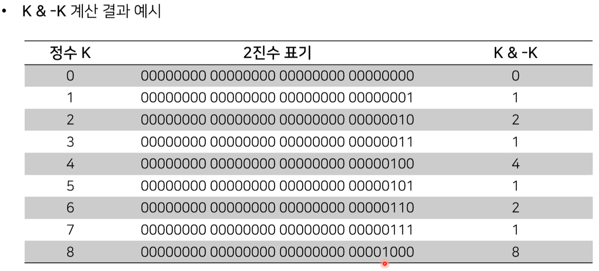
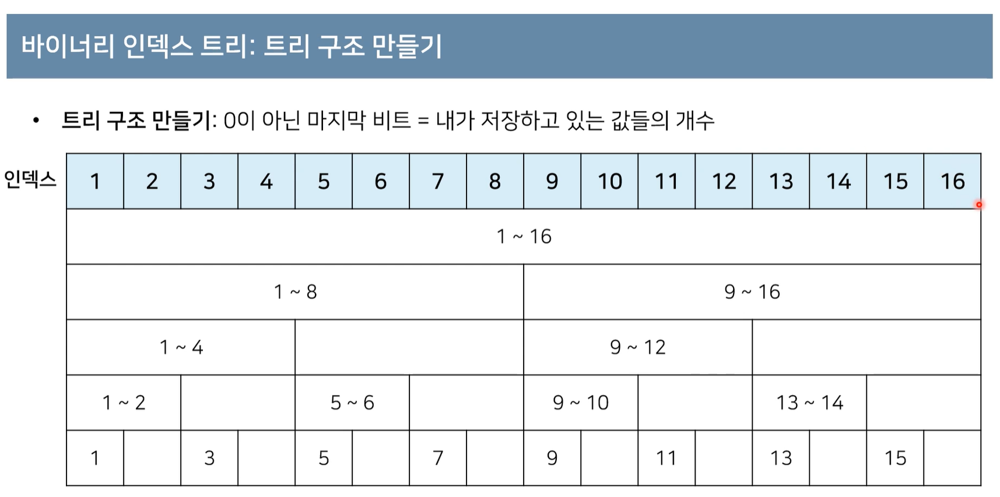
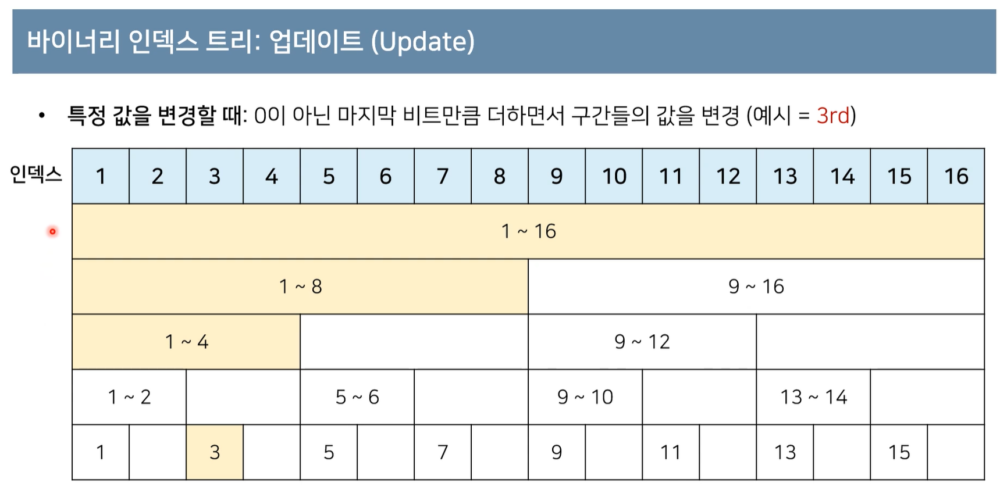
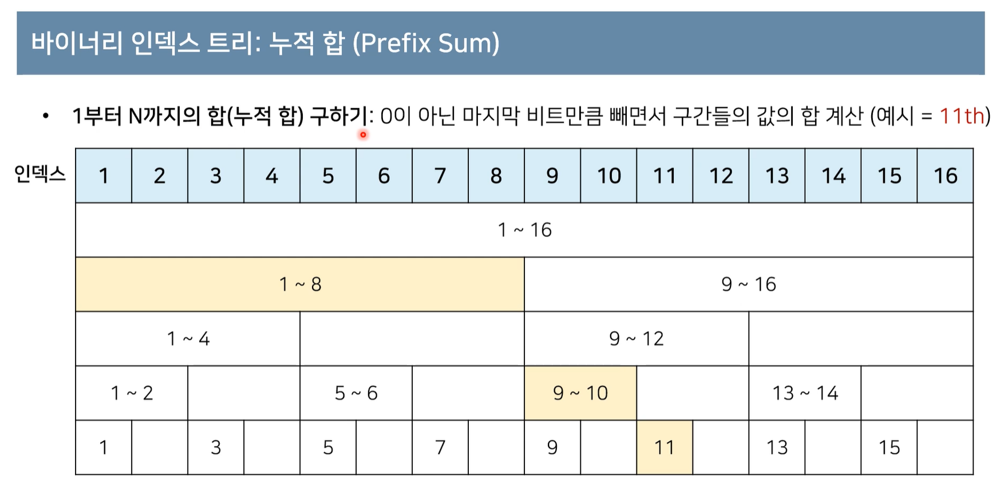

# 01. 가장 기본이 되는 자료구조

## 스택과 큐

- 스택 자료구조 

  - 먼저 들어온 데이터가 나중에 나가는 형식

  - 선입후출

  - 입구와 출구가 동일한 형태로 (프링글스 통//먼저 들어온 건 제일 뒤로 갈 수 밖에 없다는 뜻)

  -   파이썬에서 스택 자료구조를 이용하려면

     - 리스트 자료구조를 사용

     - 가장 오른쪽에 원소를 추가하는 .append() 메소드

     - 가장 오른쪽에서 원소를 삭제하는 .pop()메소드

     - ```
       Ex.)
       삽입5-삽입2-삽입3-삽입7-삽입1-삽입4
       => 왼쪽부터 5,2,3,7,1,4 순서로 쌓임
       ```

       ```
       stack.append(5)
       stack.append(2)
       stack.append(3)
       stack.append(7)
       stack.pop() # 7이 삭제 됨
       stack.append(1)
       stack.append(4)
       stack.pop() # 4가 삭제됨
       -> [5,2,3,1]
       print(stack[ : : -1 ] ) # 최상단 원소부터 출력
       => [1, 3, 2, 5]
       print(stack) # 최하단 원소부터 출력
       => [5, 2, 3, 1]
       ```

  - C++,  Javs에서 스택 구현을 하는 메소드
    - 추가는 .push()
    - 삭제는 .pop()

- 큐 자료구조

  - 먼저 들어온 데이터가 먼저 나가는 형식

  - 선입선출

  - 입구와 출구가 모두 뚫려있는 터널과 같은 형태

    ```
    Ex.)
    삽입5-삽입2-삽입3-삽입7-삽입1-삽입4
    => 왼쪽부터 4,1,7,3,2,5 순서로 쌓임
    ```

  - 파이썬에서 큐 자료구조를 이용하려면

    - deque 라이브러리를 사용

    - 큐 자료구조를 구할 때에는 파이썬에서 기본적으로 제공하는 리스트를 이용하는 것보다 deque를 이용하는게 훨씬 낫다

      ```
      from collections import deque
      #큐 구현을 위해 deque 라이브러리 사용
      queue = deque
      queue.append(5) # 리스트의 append 와 동일
      queue.append(2)
      queue.append(3)
      queue.append(7)
      queue.popleft() # 가장 왼쪽에 있는 데이터를 꺼냄 => 5가 삭제됨
      queue.append(1)
      queue.append(4)
      queue.popleft() # 2가 삭제됨
      print(queue) # 먼저 들어온 순서대로 출력
      => deque([3, 7, 1, 4])
      queue.reverse() # 역순으로 바꾸기
      print(queue) # reverse로 인해 나중에 들어온 원소부터 출력
      =>deque([4, 1, 7, 3])
      ```

    - C++
      - push, pop
    - Java
      - 추가할 땐 .offer() 메소드
      - 삭제할 땐 .poll() 메소드
        - 단순히 꺼내는 것만이 아니라 바로 반환해줌

# 02. 우선순위에 따라 데이터를 꺼내는 자료구조

- 우선순위 큐

  -  우선순위가 가장 높은 데이터를 가장 먼저 삭제하는 자료구조

  - 데이터를 우선순위에 따라 처리하고 싶을 때 사용

    - Ex). 물건데이터를 자료구조에 넣었다가 가치가 높은 물건부터 꺼내서 확인해야 하는 경우

  - ```
    스택 : 가장 나중에 삽입된 데이터가 추출됨
    큐 : 가장 먼저 삽입된 데이터가 추출됨
    우선순위 큐 : 가장 우선순위가 높은 데이터가 추출됨
    ```

  -  구현하는 방법

    1. 리스트 이용
       - 데이터를 차례대로 쭉 연결한 뒤 리스트에서 각각의 데이터를 확인 한 뒤에 값이 가장 큰 데이터를 추출
    2.  힙을 이용
       - N개의 데이터를 힙에 넣었다가 모두 꺼내는 작업은 정렬과 동일(힙 정렬)
       - 빠른 정렬화 알고리즘?

  -  힙의 특징

    - 완전 이진트리

      - 루트 노드부터 시작하여 왼쪽 자식 노드, 오른쪽 자식노드 순서대로 데이터가 차례대로 삽입되는 트리를 의미

      - 맨 위에서부터 가지치듯 왼쪽, 오른쪽 순서대로 쭉 내려옴

      - ```
                　　　　　　1
             　　2             3
          4    5       6       7
         8 9 10 11  12 13   14 15
         이런식으로
        ```

      - 

    - 힙은 일종의 트리구조로, 항상 루트노드를 제거

      -  데이터를 넣을 땐 트리에 데이터를 넣고, 꺼낼 땐 루트노드에서 꺼낸다

    - 최소 힙

      - 루트노드가 가장 작은 값을 가짐
      - 따라서 값이 작은 데이터가 우선적으로 제거됨
      - 만약 오름차순 정렬을 수행한다면 최소힙에 N개의 데이터를 그냥 다 넣은 다음에 꺼내기만 하더라도 오름차순 된 결과가 출력이 될 것이다.

    - 최대 힙

      - 루트노드가 가장 큰 값을 가짐
      - 따라서 값이 가장 큰 데이터가 우선적으로 제거

    - 최소힙 구성 함수

      - : Min-Heapify

      - (힙을 구성하기 위한 함수를 보통 Heapify라고 부른다.)

      - 상향식

        - 부모노드로 거슬러 올라가며, 부모보다 자신의 값이 더 작은 경우에 위치

        - ```
                    　　  　1
               　　5             3
            4    2      
            # 예를 들어 이런 경우, 2가 5보다 작기 때문에 최소 힙 성질을 만족하지 않음
            
                      1
               2            3
            4    5 
            # 그래서 이렇게 최소 힙 성질을 만족하도록 교체하는 것
          ```

        - 힙에 원소가 추가될 때에는 위의 과정처럼 진행됨

        - 반대로 원소가 제거될 때에는 가장 마지막노드가 루트노드의 위치에 오도록 한다

          - 이 후 다시 히피파이 함수가 최소 힙 성질을 만족하도록 교체함

        - ```
                  　　　   2
               　　5        3
            4    2          9 
            # 예를 들어 이런 경우, 2를 삭제한다면
            
                      9
               5             3
            4    2           
            # 이렇게 가장 마지막의 9가 루트노드로 이동함
            
            # 이후 다시 히피파이가 교체함
                        3
               5             9
            4    2           
          ```

      - 우선순위 큐 라이브러리를 활용한 힙정렬 구현 예제

        - 파이썬의 경우 기본적으로 힙 자료구조는 Min 힙 자료 구조.

          - ```
            # import heapq를 임포트 해서 사용할 수 있음
            #이건 강의에 나왔길래 일단 옮겨 적음
            import sys
            import heapq
            input = sys.stdin.readline
            
            def heapsort(iterable):
            	h = []
            	result = []
            #모든 원소들을 차례대로 삽입
            	for value in iterable:
            		heapq.heappush(h, value)
            
            # 힙에 삽입된 모든 원소를 차례대로 꺼내어 담기
            	for i in range(len(h)):
            		result.append(heapq.heappop(h))
            	return result
            
            n=int(input())
            arr=[]
            
            for i in range(n):
            	arr.append(int(input()))
            	
            res = heapsort(arr)
            
            for i in range(n):
            	print(resul[i])
            	
            => 오름차순 정렬된 결과가 출력 되는 걸 확인할 수 있다.
            ```

          - 맥스힙으로 정렬하고자 한다면 데이터를 담을 때와 꺼낼 때 -를 붙이면 된다(-h로 변경? )


## 03. 활용도가 높은 자료구조: 트리 자료구조

- 트리는 가계도와 같은 계층적인 구조를 표현할 떄 사용할 수 있는 자료구조
- 트리 관련 용어
  - 루트노드(root node): 부모가 없는 최상위 노드
  - 단말노드(leaf node): 자식이 없는 노드
  - 크기(size): 트리에 포함된 모든 노드의 개수
  - 깊이(depth):  루트노드로부터의 거리(루트노드의 깊이는 0)
  - 높이(height): 깊이 중 최대값
  - 차수(degree): 각 노드의 (자식방향)간선 개수(현재 자신의 노드에서 연결된 자식노드의 개수)

- 기본적으로 트리의 크기가 N일 때, 전체 간선의 개수는 N-1 이다.

- 이진탐색 트리

  - 이진**탐색**이 동작할 수 있도록 고안된 효율적인 탐색이 가능한 자료구조의 일종
  - 왼쪽 자식노드<부모노드<오른쪽 자식노드
    - 부모 노드보다 왼쪽 자식 노드가 작다
    - 부모 노드보다 오른쪽 자식 노드가 크다

  - 

    ```
    　　　　　30
    　 17            48
    5    23       37    50
    
    ```

    - 위와 같을 때, 이진 탐색 트리가 이미 구성되어 있다고 가정하고 데이터를 조회하는 과정은?

      - 찾고자 하는 원소 : 37

      1. 루트 노드부터 방문하여 탐색을 진행한다.
         1. 현재 노드(30)와 찾는 원소 37을 비교
         2. 찾는 원소가 크므로 오른쪽으로 방문
            - 48로 이동하면서 17쪽(17, 5, 23)은 안 찾아봐도 됨-> 시간 단축
      2. 현재 노드(48)보다 찾는 원소 37이 작으니 왼쪽으로 방문
      3.  원소를 찾았으므로 탐색을 종료

- 트리의 순회

  - 트리 자료구조에 포함된 노드를 특정한 방법으로 한번씩 방문하는 방법을 의미

    - 트리의 정보를 시각적으로 학인할 수 있다

  - 대표적인 트리 순회 방법

    - ```
      　　　　 A
      　 B         C
      D    E     F   G
      ```

    - 

    - 전위 순회 : 먼저 루트를 방문 한 뒤 왼쪽, 오른쪽으로 방문 : A-B-D-E-C-F-G

    - 중위 순회 : 왼쪽 자식을 먼저 방문하고 그 다음 루트를 방문한 뒤에 오른쪽으로 방문 : D-B-E-A-F-C-G

    - 후위 순회 : 왼쪽 자식을 방문한 후에 오른쪽 방문 그 뒤에 루트 방문 : D-E-B-F-G-C-A 

  - 트리의 순회 구현 예제

    - 파이썬

    - ```
      class Node:
      def __init__(self, data, left_node, right_node): # 자신의 데이터를 명시, 왼오 노드 명시
      	self.data=data
      	self.left_node=left_node
      	self.right_node=right_node
      #전위순회
      def pre_order(node):
      	print(node.data, dend=' ')
      	if node.left_node != None:
      		pre_order(tree[node.left_node])
          if node.right_node != None:
          	pre_order(tree[node.right_node])
      # 자기 자신의 데이터를 먼저 처리한 뒤 왼, 오 방문
      
      
      #중위순회
      def in_order(node):
      	if node.left_node!= None:
      		in_order(tree[node.left_node])
          print(node.data, end=' ')
          if node.right_node != None:
          	in_order(tree[node.right_node])
      # 왼쪽 먼저 방문, 자기자신 처리, 오른 방문
      
      
          	
      #후위순회
      def post_order(node):
      	if node.left_node!= None:
      		post_order(tree[node.left_node])
          if node.right_node != None:
          	post_order(tree[node.right_node])
          print(node.data, end=' ')
      # 왼, 오 방문 한 뒤 자기 자신 처리
      
      
      ######################################
      # 순회부분보다 여기를 먼저 설명하던데?
      n=int(input() ) #트리의 크기. 즉 노드의 개수
      tree={} # 트리는 딕셔너리를 이용해서 구현 가능
      
      for i range(n)
      	data, left_node, right_node = input().split()
      	if left_node == "None":
      		left_node = None
          if right_node == 'None':
          	right_node = None
          tree[data] = Node(data, left_node, right_node) # 데이터는 트리에 담을 수 있도록, 각 노드는 자기 자신의 데이터와 자신의 왼오 노드가 어떤건지 담을 수 있게
          
      # 데이터를 다 받은 뒤에 전위순회, 중위순회, 후위순회를 출력
      pre_order(tree['A'] )
      print()
      in_oreder(tree['A'] )
      print()
      post_order(tree['A'] )
      
      ###############
      #입력예시
      7
      A B C
      B D E
      C F G
      D None None
      E None None 
      F None None
      G None None
      # => 출력결과
      A B D E C F G
      D B E A F C G
      D E B F G C A
      ```

## 04. 특수하나 목적의 자료구조 : 바이너리 인덱스 트리

- 데이터 업데이트가 가능한 상황에서의 구간 합 문제

  - [백준 '구간 합 구하기 문제'](https://www.acmicpc.net/problem/2042)

- 어떤 N개의 수가 주어져 있다. 그런데 중간에 수의 변경이 빈번히 일어나고 그 중간에 어떤 부분의 합을 구하려 한다. 만약에 1, 2, 3, 4, 5라는 수가 있고, 3번째 수를 6으로 바꾸고 2번째부터 5번째까지 합을 구하라고 한다면 17을 출력하면 되는 것이다. 그리고 그 상태에서 다섯 번째 수를 2로 바꾸고 3번쨰부터 5번째까지 합을 구하라고 한다면 12가 될 것이다.

- 데이터 개수 : N(1<= N <= 1,000,000)

- 데이터 변경 횟수: M(1<=M<=10,000)

- 구간 합 계산 횟수: K(1<=K<=10,000)

- 이 문제를 어떻게 해결할 수 있을까 

  - 만약, 구간 합을 구할 때마다 일일이 구한다면 N*K만큼의 연산이 필요

- 이럴 때 사용할 수 있는 것이 `바이너리 인덱스 트리`

  - `바이너리 인덱스 트리`는 2진법 인덱스 구조를 활용해 구간 합 문제를 효과적으로 해경해 줄 수 있는 자료구조를 의미

  - `펜윅 트리`라고도 한다

  - K & -K 를 사용...(?)

  - 

    - 0이 아닌 마지막 수가 K?
    - 맨 끝부터 차레대로 1, 2, 4, 8 ... 2의 배수 인 듯

  - ```
    n = 8
    for i in range(n+1):
    	print(i, "의 마지막 비트:", (i & -i) )
    
    ```

- 바이너리 인덱스 트리: 트리 구조 만들기

  - 
  - 특정값을 변경할 때: 0이 아닌 마지마 비트만큼 더하면서 구간들의 값을 변경(바꾸고자 하는 그 특정위치의 값부터 시작해서)

- 바이너리 인덱스 트리: 업데이트

  - 
  - 바꾸고자 하는 특접 값부터 0이 아닌 마지막 비트만큼 더하면서 구간들의 값을 변경
  - 3은 0이아닌 마지막 비트는 1.  그래서 1칸 이동
  - 4에 대한 값 변경. 4에서 4칸 이동
  - 8에대한 값 변경.  8에서 8칸 이동하여 16칸의 값 변경
  - 3, 4, 8, 16은 모두 이 3번째 위치에 대한 값의 합 정보를 담고 있는 인덱스라 할 수 있다
  - 총 4번 값을 업데이트
  - 
  - 

- 바이너리 인덱스 트리: 누적 합

  - 
  - 1부터 11번쨰 까지 누적합을 구한다하면
  - 11부터 시작. 인덱스 11은 11하나의 값을 담고 있고
  - 1만끔 빼서 왼쪽으로 이동
  -  9부터 10까지의 값의 합을 담고 있는 인덱스 10의 값을 더한 뒤 다시 왼쪽으로 2칸 이동
  - 1부터 8까지의 총합을 담고 있는 인덱스 8의 값을 더하면
  - 결과적으로 1부터 11까지 총 11개의 원소의 합계를 구할 수 있게 되는 것

- 파이썬으로 구현

- ```
  import sys
  input = sys.stdin.readline
  
  #데이터의 개수(n), 변경횟수(m), 구간 합 계산 횟수(k)
  n, m, k = map(int, input().split() )
  
  #전체 데이터의 개수는 최대 1,000,000개
  arr=[0]*(n+1)
  tree=[0]*(n+1)
  
  #i번쨰 수까지의 누적합을 계산하는 함수
  def prefix_sum(i):
  	result = 0
  	while i > 0:
  		result += tree[i]
  		#0이 아닌 마지막 비트만큼 뺴가면서 이동
  		i -= (i & -i)
  	retrn result
  # 0이 아닌 마지막 비트만 큼 뺴가면서 앞쪽으로 이동하며 그 합계값을 더해줄 수 있도록
  	
  	
  #i번쨰 수를 dif만큼 더하는 함수
  def update(i, dif):
  	while i <= n:
  		tree[i] += dif
  		i += ( i & -i)
  # i번쨰 수에 대해서 특정값만 큼 더할 떄
  # 트리에서 0이아닌 마지막 비트만큼 이동하며 얼만큼의 값을 더해줄지
  
  
  
  #start부터 end까지의 구간 합을 계산하는 함수
  def interval_sum(start, end):
  	return prefix_sum(den) - prefix_sum(start-1)
  # 기본적으로 구간 합을 구하고자 할 떄 가장 많이 사용
  #end까지의 누적합에서 start-1번쨰 까지의 누적합을 뺴는 방식
  #stat부터 end까지의 구간합을 구할 수 있다
  	
  	
  	
  for i in range(1, n + 1):
  	x = int(input())
  	arr[i] = x
  	update(i, x)
  
  for i in range(m + k):
  	a, b, c = map(int, input().split())
  	# 업데이트(update)연산인 경우
  	if a == 1:
  		update(b, c - arr[b]) # 바뀐 크기(dif)만큼 적용. 특정번째 값에 대해서(b?) 얼만큼 값이 바뀌었는지. 이를 파라미터로 넘김
  		arr[b] = c
  	#구간 합(interval sum)연산인 경우
  	else:
  		print(interval_sum(b,c))
  		#어디서 부터 어디까지의 구간 합을 구할 것인지 출력
  
  
  
  ```

- 


