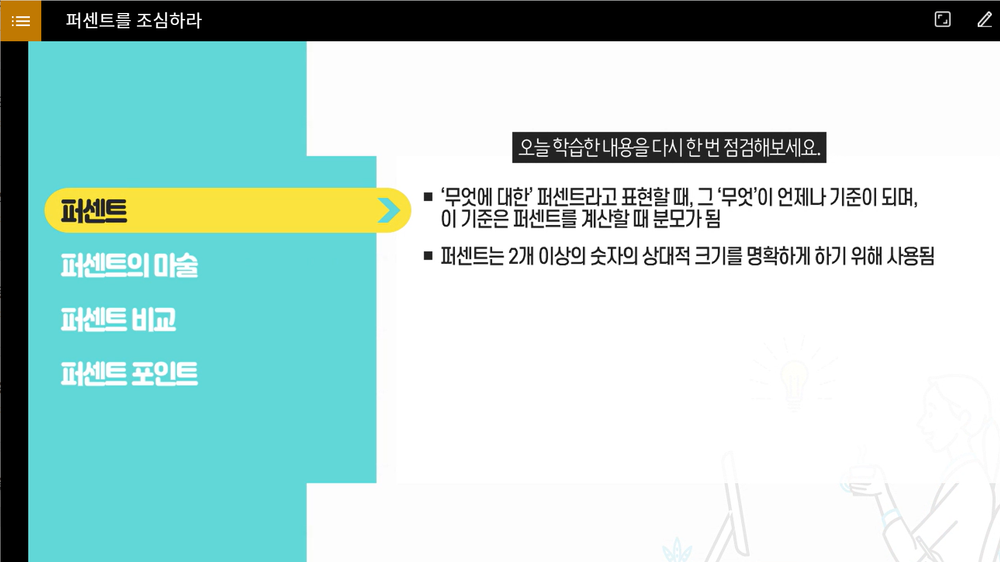
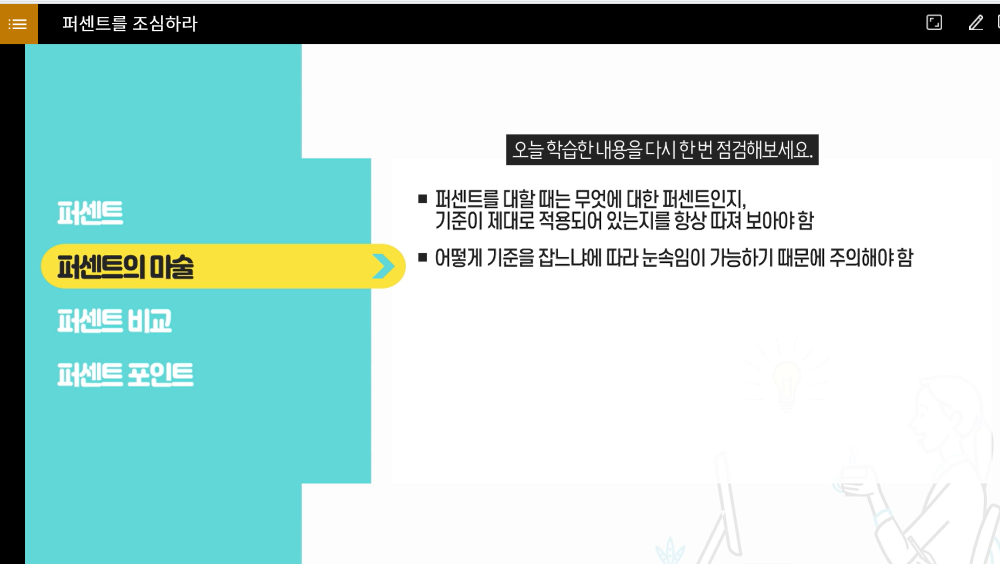
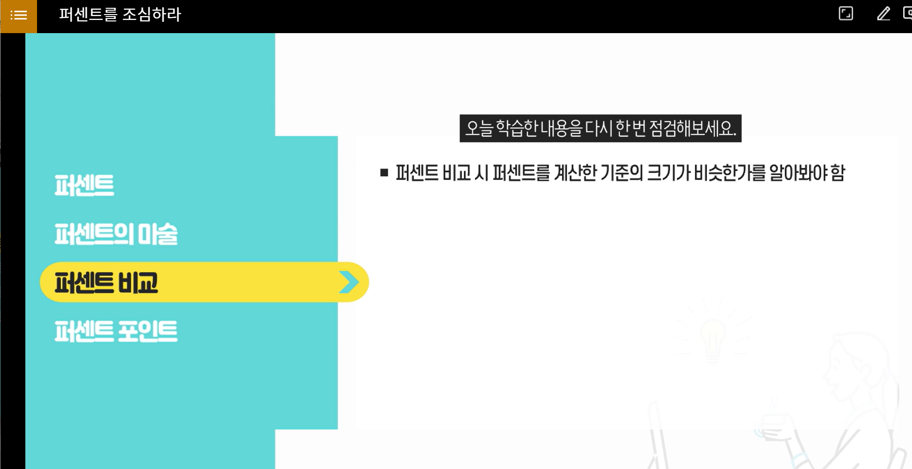
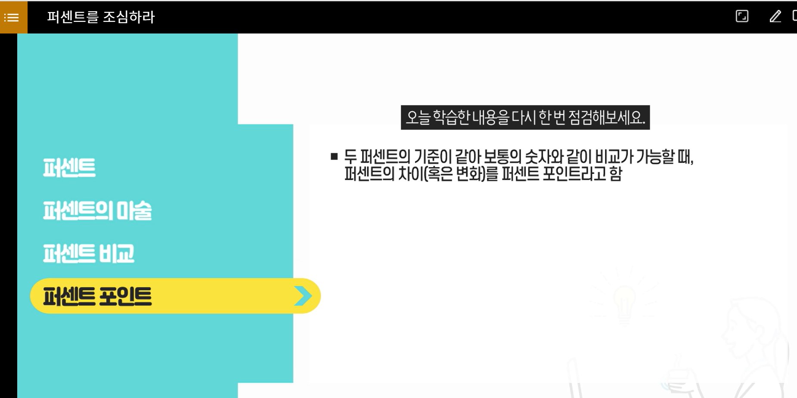
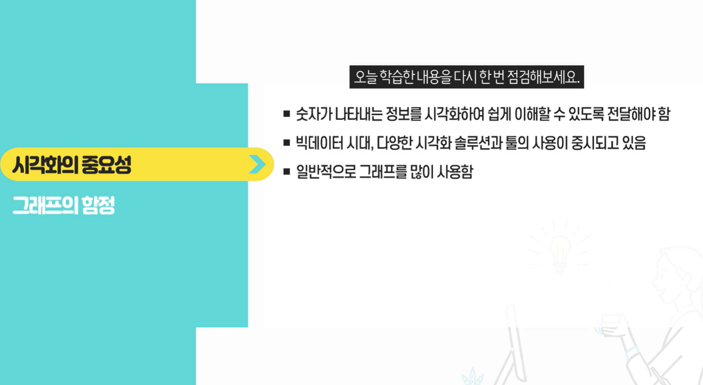
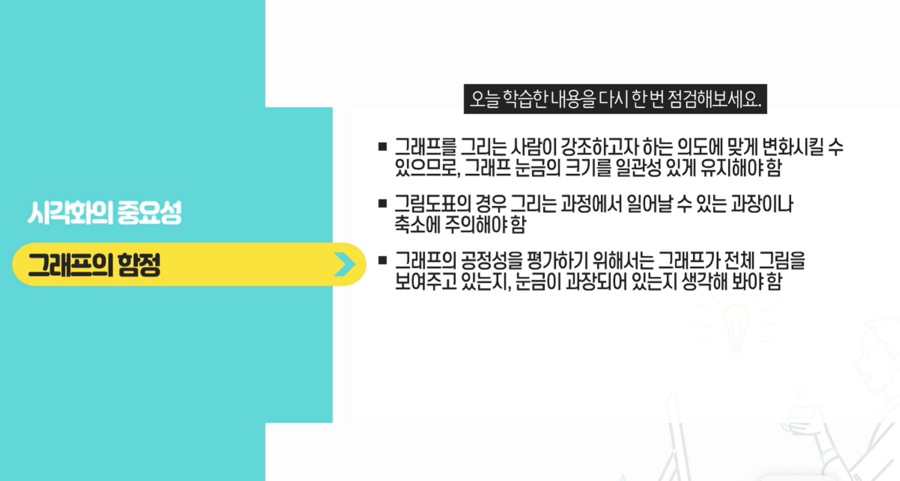
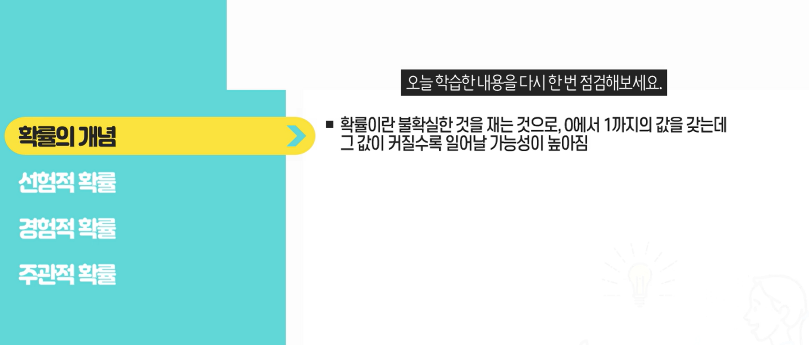
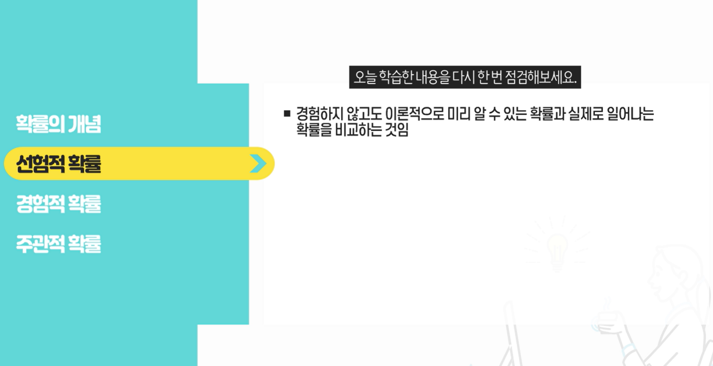
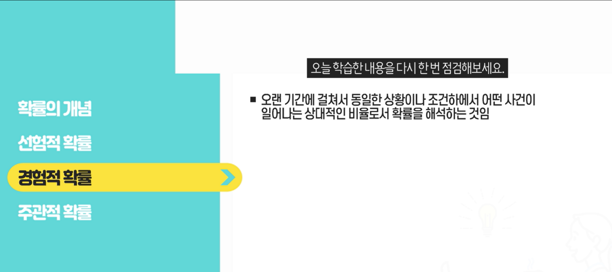
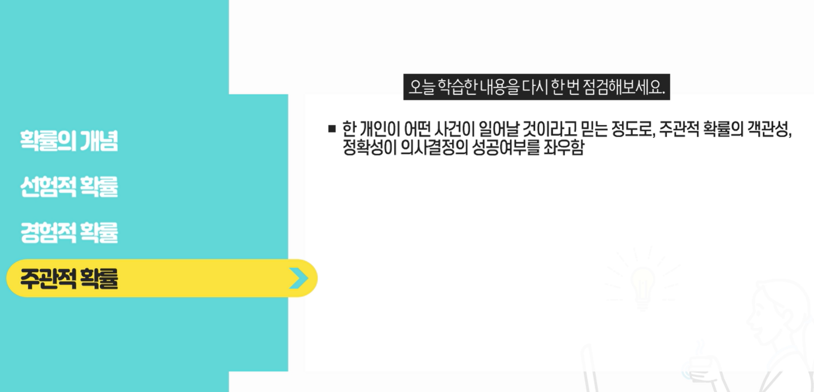

- 평균의 함정
  - 
  - 
  - 
  
  

## 퍼센트를 조심하라

- 
- 
- 
- 

## 시각화의 오용과 남용

- 
- 

## 확률의 종류

- 
- 
- 
- 

## 확률을 이용한 판단 오류

- 확률의 함정
  - 대부분의 사람들은 확률에 대한 이해가 매우 낮으므로, 정확한 의사결정을 위해서는 올바른 확률 계산이 필수이다
- 도박사의 오류
  - 시도(혹은 실험)을 반복하면 반복할 수록 원래의 이론적인 확률에 접근한다는 평균의 법칙 혹은 대수의 법칙으로 인해 독립적인 사건들을 어떤 관계가 있는 종속적인 사건으로 보는 도박사의 오류가 발생한다.
- 유용성의 오류
  - 사람들이 확률 판단을 하는데 있어서 일어나는 것으로 쉽게 기억나는 사건들이 일어날 확률이 높다고 평가하는 것

##  여론조사 올바로 이해하기

- 표본조사와 대표성
  - 표본조사 : 전체가 아닌 일부 표본을 조사하는 방법
  - 대표성 : 모집단에서 무작위로 추출한 표본은 모집단의 대표성을 띄어야 함

- 표본의 무작위 추출
  - 모집단에 속한 대상들이 표본에 뽑힐 확률이 모두 동일한 것
  - 표본을 뽑을 때 표본을 뽑는 사람의 판단이나 편리함이 전혀 고려되지 않음
  - 뽑기에 편리한, 주로 가까이에 있는 대상을 표본으로 추출한 편의 표본
- 질문과 응답항목
  - 질문에 미리 어떤 가치 판단을 깔아놓고 답을 원하는 방향으로 유도할 수 있으므로, 질좋은 질문을 하는 것이 중요함
  - 어떤 응답항목에 대한 응답비율을 높이려는 조사자의 의도가 개입되어서는 안됨
- 조사결과의 해석
  - 조사결과의 확대해석도 일반인들이 조사결과를 대할 때 경계해야 함
  - 왜곡된 정보를 주고받지 않으려면 조사결과에 대한 행간을 파악해야 함
  - 표본이 적절한가에 대한 것도 생각해야 함
  - 모집단의 정의, 표집방법, 응답률, 표본의 크기 등에 있어 표본의 대표성이 유지되는지 체크해야 함

## 상관관계는 인과관계가 아니다

- 인과관계
  - 원인은 결과보다 시간적으로 앞서야 함
  - 원인과 결과는 관련이 있어야 함
  - 결과는 원인이 되는 변수만으로 설명이 되어야하고  다른 변수에 의한 설명은 제거되어야 함

- 상관관계
  - 어떤 변수가 증가할 때 다른 변수가 함께 증가하는지 혹은 감소하는지를 관찰하여 파악해야 함
  - 어떤 것들 간의 관계가 밀접하다는 것을 나타낼 뿐, 어느 것이 원인이고 어느 것이 결과인지에 대해서는 아무런 증거도 제공하지 않음
  - 단순한 상관관계를 인간관계로 해섯하는 오류를 주의해야 함
- 우연한 상관관계
  - 우연히 상관관계를 나타내는 경우가 흔하다는 것으로, 통계학에서는 허위 관련성이라고 함
  - A가 일어난 다음에 B가 일어났다고 해서 A가 B의 원인이라고 결론짓는 것을 전후인과의 오류라고 함

- 인과관계의 방향
  - 상관관계가 있다고 할 때 흔히 생각하는 것과 반대방향으로 인과관계가 작용할 수 있음
  - 성급하게 단순화하는 오류를 그대로 받아들이지 않도록 주의해야 함

##  비교, 어떻게 해야할까?

- 비교
  - 비교 : 둘 이상의 사물을 견주어 서로 간의 유사점, 차이점, 일반 법칙 따위를 고찰하는 것
  - 비교 대상을 계량화하기 어려운 경우에 남이 것이 더 커보임
- 올바로 비교하는 법
  - 정확한 비교가 되려면, 비교되는 특성에 대한 정의가 동일해야하며, 비교되는 특성이외의 것들에 대해서는 서로 비슷해야 함